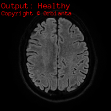

# Brain MRI Tumor Detection with Tensorflow

 
☝️ My brains MRI image right there!

🥳 Hello there! 
I'm Cem Pişkinpaşa, also known as 0rbianta and /dev/null on internet. Lastly I were having some possible neurological problems so I spent some time on the hospital. My neurological peak went nice. I glad that my brain and body were working together very well and responsing to all the tests doctor applied. After passing the tests successfully an MRI image also required so I spent some time on closed MRI too. I tought that all of this time and effort I spent on the hospital went to nothing because my body were doing so well so after getting the MRI images I went back to home and decided to create an AI that be able to decide am I healthy or not by my brain MRI images. The hopitals were give me the images on a DICOM file format and a software be able to read them on a DVD. I pass that files to my workspace and started to programming. Found an MRI dataset over the internet and trained the Google's most light neural network model, MobileNetv2. Fastly made a DICOM reader too and guess what. My AI were working faster then the whole hospital and I were already got my results before the doctor tells me. Welcome to the future!  

Third-party contents  
Anonymous_Pro -> https://fonts.google.com/specimen/Anonymous+Pro  
Brain MRI Dataset -> https://www.kaggle.com/datasets/navoneel/brain-mri-images-for-brain-tumor-detection  
Contact me  
Cem Pişkinpaşa(He/him)  
Mail: orbianta@protonmail.com  
GitHub: https://github.com/0rbianta

---
Licensed under GPL-3.0. Copyright © 0rbianta
